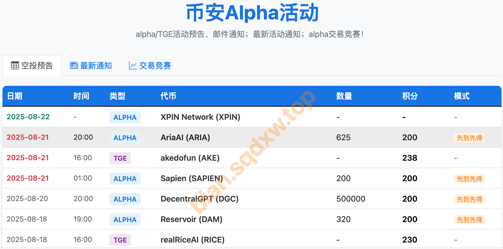
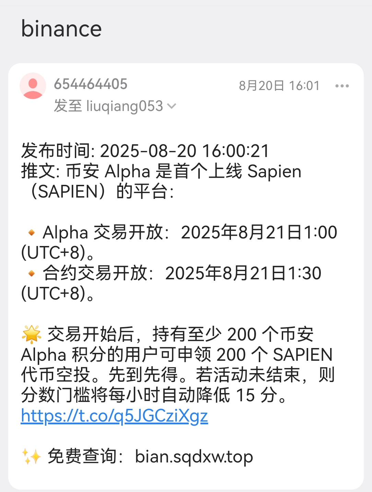
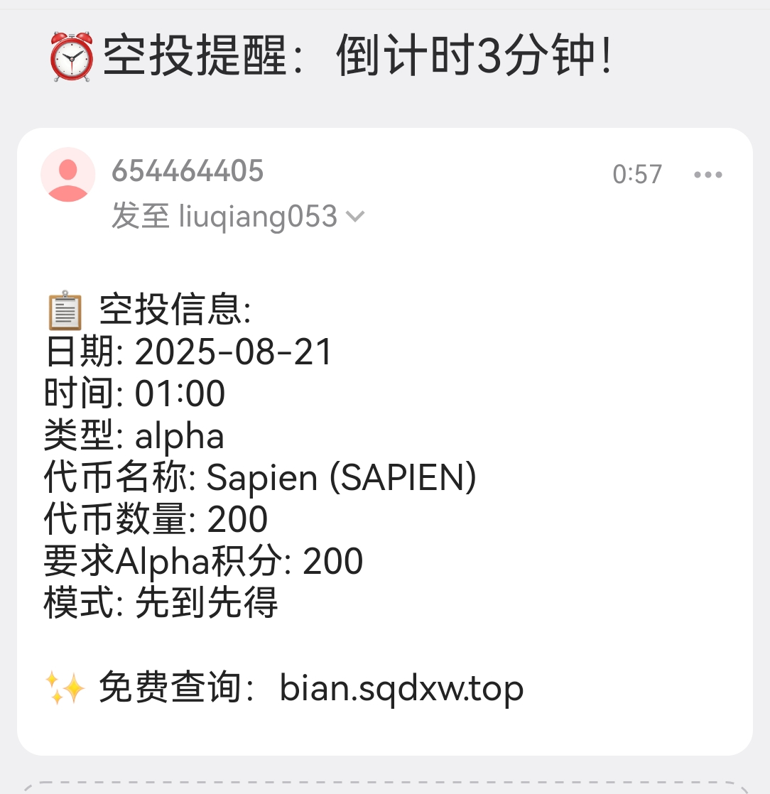
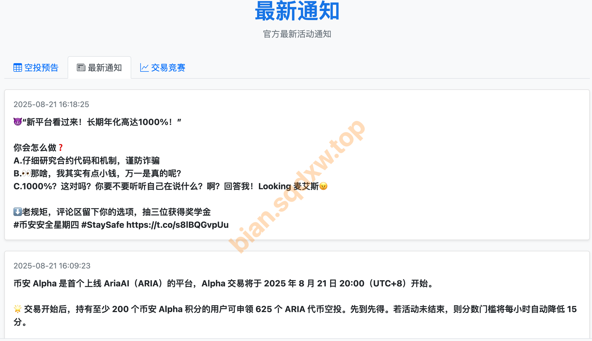
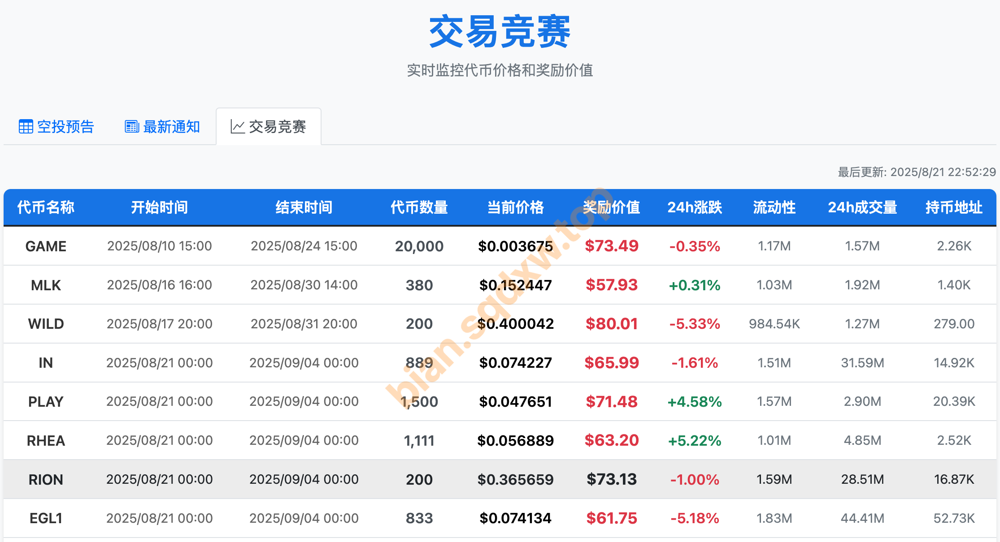
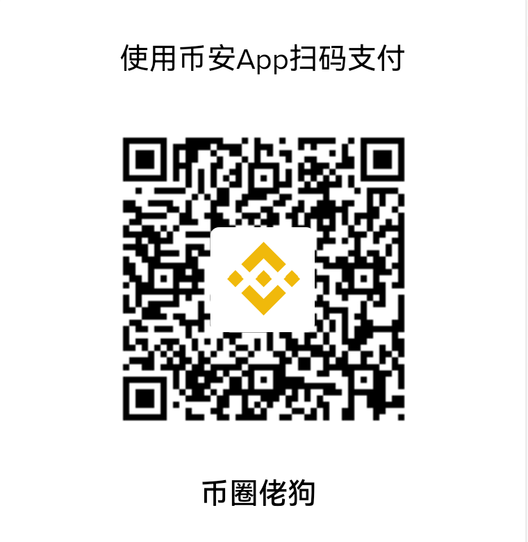
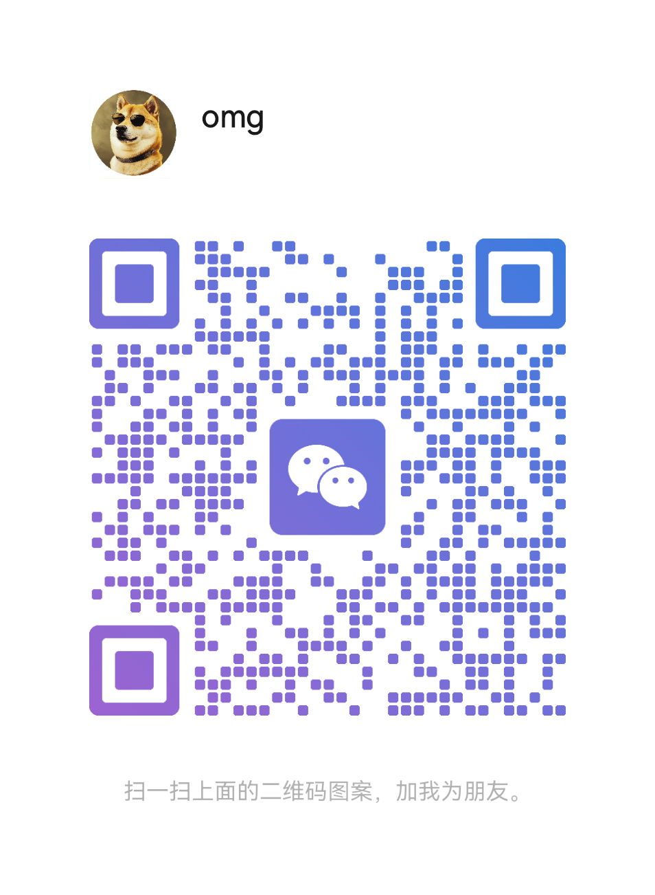

# 币安Alpha/TGE空投活动预告｜邮件推送｜官方活动通知｜alpha交易竞赛

## 地址：**https://bian.sqdxw.top/**

## 1. Alpha/TGE空投活动预告
可以查看空投预告及历史空投信息。

## 2. Alpha/TGE空投活动邮件推送（付费，费用见第5条）
**双重通知，空投不错过！**

币安官方发布空投信息后，自动发送邮件通知；并且会在空投发放前3分钟再次邮件通知。

## 3. 官方活动通知
币安华语所有活动通知均可以在这里查看。

## 4. 交易竞赛查询
查询alpha交易竞赛代币信息、活动时间及实时奖励价值等信息。

## 5. 邮件推送付费服务

#### 费用
根据周期，有如下4档套餐可选：  
- 3u/月
- 5u/2月
- 12u/6月
- 20u/12月

#### 付费方式

选定套餐后，用币安App扫码支付对应金额（备注有效邮箱地址）。

#### 咨询

如有需要，可扫码添加微信好友（一定要说明来意！）

---

## 其他工具

#### 1.钱包Alpha交易积分查询：
  - https://www.bn-alpha.site/
  - https://blockai.pro/alpha-tool
  - https://new.alphabot.cm/

#### 2.Alpha刷分人数查询：
  - https://tonvox.com/

#### 3.TGE打新查询
  - https://bn-ido.vercel.app/

#### 4.TGE预授权
  - https://wallet.ritmex.one/   
---

# 2025年币安App注册全流程指南（iOS/安卓）

## 一、电脑端快速注册
1. **前置准备**  
   - 开启科学上网工具
   - 访问[官方注册链接](https://www.binance.com/zh-CN/join?ref=SQDXW888)
   - 推荐码：**SQDXW888**（返还佣金的50%）

2. **注册步骤**  
   - 选择"通过邮箱/手机号注册"（推荐邮箱）
   - 输入海外邮箱（如Gmail）+ 设置复杂密码
   - 完成滑块验证 → 获取邮箱验证码 → 提交

## 二、安全下载App

### ▶ 安卓用户
1. 科学上网后访问binance.com官网
2. 点击"下载Android APK"
3. 设置→允许未知来源安装→安装APK
4. [下载链接](https://download.marketwebb.ninja/pack/BNApp_00000058.apk)

### ▶ iOS用户
**核心问题**：需非大陆Apple ID  
**解决方案**：
- 方法A：自行注册美区/港区ID（最安全）
- 方法B：电商平台购买现成ID（仅用于App Store）

**下载流程**：
1. 退出当前Apple ID
2. 登录海外ID
3. 搜索"Binance"下载
4. [下载链接](https://www.marketwebb.net/download-guide?hl=zh-CN)

## 三、手机端KYC认证
1. **填写信息**  
   - 居住地选"中国"
   - 确保姓名/身份证号与证件完全一致

2. **证件上传**  
   - 选择"身份证"
   - 依次拍摄/上传：正面 → 反面

3. **人脸识别**  
   - 按提示完成眨眼/张嘴等动作
   - 审核通常10-15分钟

> 通过后账户即激活，可开始交易

